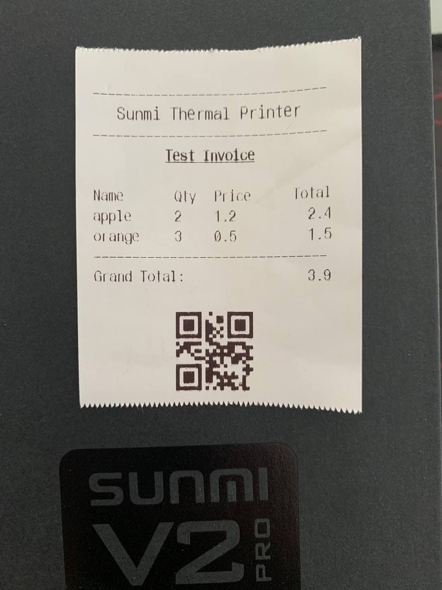

# sunmi_thermal_printer

This project is fork from [flutter_sunmi_printer](https://pub.dev/packages/flutter_sunmi_printer) and support null safety.

This Plugin allows to print thermal receipts using Sunmi device with a built-in printer.

## Features

- `text`: print text with styles (bold, underline, align, font size)
- `row`: print a row containing up to 12 columns (total columns width must be equal to 12)
- `image`: print an image with alignment
- `hr`: print full width separator
- `emptyLines`: feed _n_ lines
- `cutPaper`
- `boldOn`, `boldOff`
- `underlineOn`, `underlineOff`

## Getting Started

```dart
import 'dart:convert';
import 'dart:typed_data';

import 'package:flutter/material.dart';
import 'package:flutter/services.dart';
import 'package:sunmi_thermal_printer/sunmi_thermal_printer.dart';

void main() {
  runApp(MyApp());
}

class MyApp extends StatefulWidget {
  @override
  _MyAppState createState() => _MyAppState();
}

class _MyAppState extends State<MyApp> {
  final List products = [
    {"name": "apple", "qty": 2, "price": 1.2},
    {"name": "orange", "qty": 3, "price": 0.5}
  ];

  @override
  Widget build(BuildContext context) {
    return MaterialApp(
      home: Scaffold(
        appBar: AppBar(
          title: const Text('Sunmi Thermal Printer'),
        ),
        body: Center(
          child: ElevatedButton(
            onPressed: _printTest,
            child: const Text('Print Test', style: TextStyle(fontSize: 20)),
          ),
        ),
      ),
    );
  }

  void _printTest() async {
    // Horizontal line
    SunmiThermalPrinter.hr();
    // Regular text
    SunmiThermalPrinter.text(
      'Sunmi Thermal Printer',
      styles: SunmiThermalStyles(
        align: SunmiThermalAlign.center,
        size: SunmiThermalSize.mg,
      ),
    );
    SunmiThermalPrinter.hr();
    SunmiThermalPrinter.text('Test Invoice',
        styles: SunmiThermalStyles(
          size: SunmiThermalSize.md,
          bold: true,
          underline: true,
          align: SunmiThermalAlign.center,
        ));

    // Add Space
    SunmiThermalPrinter.emptyLines(1);

    // Row must be 12 width
    SunmiThermalPrinter.row(
      cols: [
        SunmiThermalColumn(
            text: 'Name', width: 4, align: SunmiThermalAlign.left),
        SunmiThermalColumn(
            text: 'Qty', width: 2, align: SunmiThermalAlign.left),
        SunmiThermalColumn(
            text: 'Price', width: 3, align: SunmiThermalAlign.left),
        SunmiThermalColumn(
            text: 'Total', width: 3, align: SunmiThermalAlign.right),
      ],
    );

    double grandTotal = 0.0;
    products.forEach((product) {
      final double total = product['qty'] * product['price'];
      grandTotal += total;
      SunmiThermalPrinter.row(
        cols: [
          SunmiThermalColumn(
            text: product['name'],
            width: 4,
            align: SunmiThermalAlign.left,
          ),
          SunmiThermalColumn(
            text: product['qty'].toString(),
            width: 2,
            align: SunmiThermalAlign.left,
          ),
          SunmiThermalColumn(
            text: product['price'].toString(),
            width: 3,
            align: SunmiThermalAlign.left,
          ),
          SunmiThermalColumn(
            text: total.toString(),
            width: 3,
            align: SunmiThermalAlign.right,
          ),
        ],
      );
    });

    SunmiThermalPrinter.hr();
    SunmiThermalPrinter.row(
      cols: [
        SunmiThermalColumn(
            text: 'Grand Total:', width: 5, align: SunmiThermalAlign.left),
        SunmiThermalColumn(
            text: grandTotal.toString(),
            width: 7,
            align: SunmiThermalAlign.right),
      ],
    );

    SunmiThermalPrinter.emptyLines(1);

    // Test image
    // Uint8List bytes = (await NetworkAssetBundle(Uri.parse(url)).load(url)).buffer.asUint8List();
    ByteData bytes = await rootBundle.load('assets/qr_code.jpg');
    final buffer = bytes.buffer;
    final imgData = base64.encode(Uint8List.view(buffer));
    SunmiThermalPrinter.image(imgData);

    SunmiThermalPrinter.emptyLines(3);

    // Cut paper (Only supported device)
    // SunmiThermalPrinter.cutPaper();
  }
}
```

## Tested Devices
- Sunmi V2 Pro

## Screenshot


